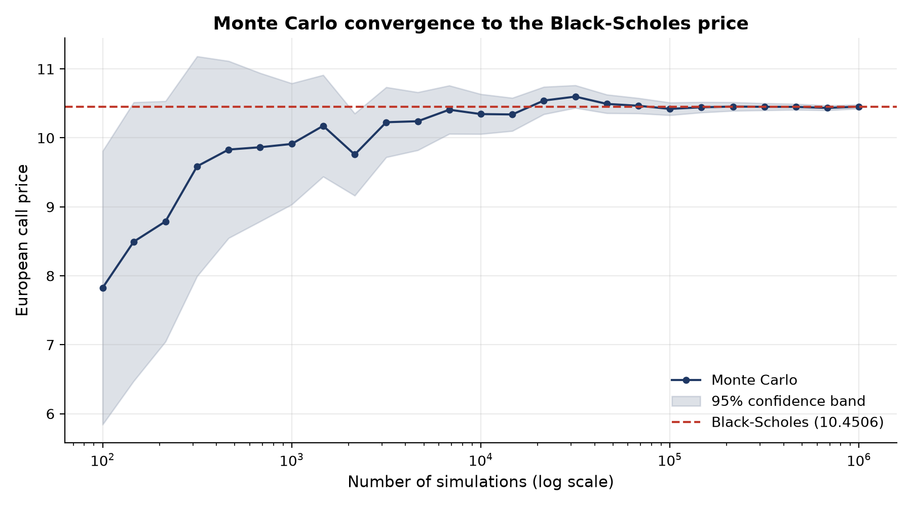

# European Option Pricing: Black-Scholes and Monte Carlo

Python implementation of European call and put pricing, validated against analytical identities and a Monte Carlo simulation.

## What this project does

- Prices European calls and puts with the **Black-Scholes formula**
- Verifies correctness with a **put-call parity** check
- Prices the call by **Monte Carlo simulation** under risk-neutral dynamics
- Quantifies simulation error with a **95% confidence band** and shows convergence to the analytical price

## Method

**Black-Scholes**

$$d_1 = \frac{\ln(S/K) + (r + \sigma^2/2)T}{\sigma\sqrt{T}}, \qquad d_2 = d_1 - \sigma\sqrt{T}$$

$$C = S\,N(d_1) - K e^{-rT} N(d_2), \qquad P = K e^{-rT} N(-d_2) - S\,N(-d_1)$$

**Monte Carlo**

Terminal price under the risk-neutral measure:

$$S_T = S \exp\left(\left(r - \tfrac{\sigma^2}{2}\right)T + \sigma\sqrt{T}\,Z\right), \qquad Z \sim N(0,1)$$

The call price is the discounted average payoff $e^{-rT}\,\mathbb{E}[\max(S_T - K, 0)]$, and the standard error is $s/\sqrt{n}$.

## Results

Test case: $S=100,\ K=100,\ T=1,\ r=0.05,\ \sigma=0.2$

| Method | Call price |
|---|---|
| Black-Scholes | 10.4506 |
| Monte Carlo (100,000 paths) | 10.4205 (SE 0.047) |

- Black-Scholes put: 5.5735
- Put-call parity $C - P = S - Ke^{-rT}$ holds to numerical precision



The Monte Carlo estimate converges to the analytical price. The error shrinks proportionally to $1/\sqrt{n}$: 100x more simulations give a 10x smaller standard error. A fixed random seed is used for reproducibility.

## How to run

```bash
git clone https://github.com/rachellliz/Option-pricing-python.git
cd Option-pricing-python
python -m venv .venv
source .venv/bin/activate
pip install -r requirements.txt
jupyter notebook option_pricing.ipynb
```

## Possible extensions

- Pricing with real market data (historical volatility from yfinance)
- Variance reduction (antithetic variates)
- Path-dependent options (Asian, barrier)